  <!-- PHASE 1: ANIMATED TERMINAL BANNER -->
  <picture>
    <source media="(prefers-color-scheme: dark)" srcset="dark.svg">
    <source media="(prefers-color-scheme: light)" srcset="light.svg">
    
  </picture>

    

  <!-- PHASE 4: SOCIAL BADGES -->
  
  &nbsp;&nbsp;
  
  &nbsp;&nbsp;
  
  &nbsp;&nbsp;
  

    

  <!-- PHASE 2: STATS CARDS (Self-Hosted via Vercel) -->
  <!-- Note: Replace YOUR_VERCEL_INSTANCE with your deployed Vercel domain once deployed -->
  

    

  
  &nbsp;
  

    

  <!-- PHASE 3: CONTRIBUTION SNAKE -->
  <picture>
    <source media="(prefers-color-scheme: dark)" srcset="https://raw.githubusercontent.com/Darksun1310/Darksun1310/output/github-contribution-grid-snake-dark.svg">
    <source media="(prefers-color-scheme: light)" srcset="https://raw.githubusercontent.com/Darksun1310/Darksun1310/output/github-contribution-grid-snake-light.svg">
    
  </picture>

